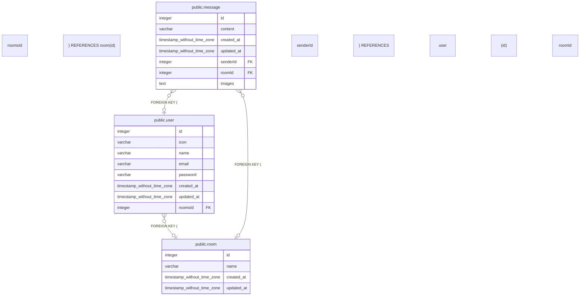

# database

## テーブル一覧

| 名前 | カラム一覧 | コメント | タイプ |
| ---- | ------- | ------- | ---- |
| [public.user](public.user.md) | 8 |  | BASE TABLE |
| [public.message](public.message.md) | 7 |  | BASE TABLE |
| [public.room](public.room.md) | 4 |  | BASE TABLE |

## ER図

---

> Generated by [tbls](https://github.com/k1LoW/tbls)
