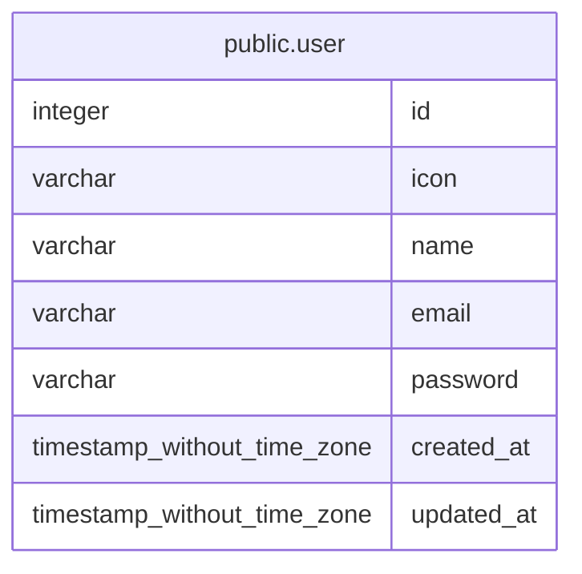

# database

## Tables

| Name | Columns | Comment | Type |
| ---- | ------- | ------- | ---- |
| [public.user](public.user.md) | 7 |  | BASE TABLE |

## Relations

---

> Generated by [tbls](https://github.com/k1LoW/tbls)
