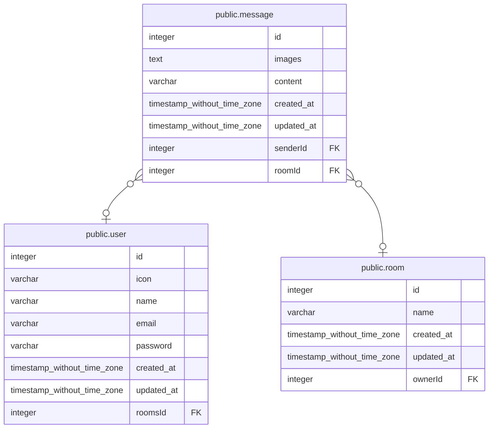

# public.message

## 概要

## カラム一覧

| 名前 | タイプ | デフォルト値 | Nullable | 子テーブル | 親テーブル | コメント |
| ---- | ------ | ------------ | -------- | ---------- | ---------- | -------- |
| id | integer | nextval('message_id_seq'::regclass) | false |  |  |  |
| images | text |  | true |  |  |  |
| content | varchar |  | false |  |  |  |
| created_at | timestamp without time zone | now() | false |  |  |  |
| updated_at | timestamp without time zone | now() | false |  |  |  |
| senderId | integer |  | true |  | [public.user](public.user.md) |  |
| roomId | integer |  | true |  | [public.room](public.room.md) |  |

## 制約一覧

| 名前 | タイプ | 定義 |
| ---- | ---- | ---------- |
| FK_fdfe54a21d1542c564384b74d5c | FOREIGN KEY | FOREIGN KEY ("roomId") REFERENCES room(id) |
| PK_ba01f0a3e0123651915008bc578 | PRIMARY KEY | PRIMARY KEY (id) |
| FK_bc096b4e18b1f9508197cd98066 | FOREIGN KEY | FOREIGN KEY ("senderId") REFERENCES "user"(id) |

## INDEX一覧

| 名前 | 定義 |
| ---- | ---------- |
| PK_ba01f0a3e0123651915008bc578 | CREATE UNIQUE INDEX "PK_ba01f0a3e0123651915008bc578" ON public.message USING btree (id) |

## ER図

---

> Generated by [tbls](https://github.com/k1LoW/tbls)
