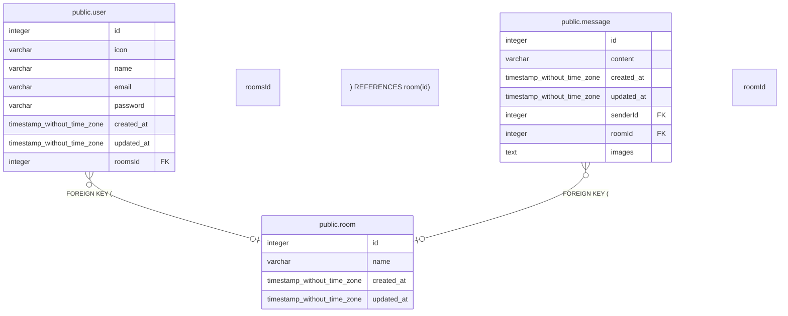

# public.room

## 概要

## カラム一覧

| 名前 | タイプ | デフォルト値 | Nullable | 子テーブル | 親テーブル | コメント |
| ---- | ------ | ------------ | -------- | ---------- | ---------- | -------- |
| id | integer | nextval('room_id_seq'::regclass) | false | [public.user](public.user.md) [public.message](public.message.md) |  |  |
| name | varchar |  | false |  |  |  |
| created_at | timestamp without time zone | now() | false |  |  |  |
| updated_at | timestamp without time zone | now() | false |  |  |  |

## 制約一覧

| 名前 | タイプ | 定義 |
| ---- | ---- | ---------- |
| PK_c6d46db005d623e691b2fbcba23 | PRIMARY KEY | PRIMARY KEY (id) |

## INDEX一覧

| 名前 | 定義 |
| ---- | ---------- |
| PK_c6d46db005d623e691b2fbcba23 | CREATE UNIQUE INDEX "PK_c6d46db005d623e691b2fbcba23" ON public.room USING btree (id) |

## ER図

---

> Generated by [tbls](https://github.com/k1LoW/tbls)
