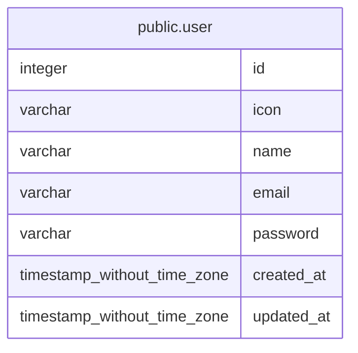

# public.user

## Description

## Columns

| Name | Type | Default | Nullable | Children | Parents | Comment |
| ---- | ---- | ------- | -------- | -------- | ------- | ------- |
| id | integer | nextval('user_id_seq'::regclass) | false |  |  |  |
| icon | varchar |  | false |  |  |  |
| name | varchar |  | false |  |  |  |
| email | varchar |  | false |  |  |  |
| password | varchar |  | false |  |  |  |
| created_at | timestamp without time zone | now() | false |  |  |  |
| updated_at | timestamp without time zone | now() | false |  |  |  |

## Constraints

| Name | Type | Definition |
| ---- | ---- | ---------- |
| PK_cace4a159ff9f2512dd42373760 | PRIMARY KEY | PRIMARY KEY (id) |
| UQ_e12875dfb3b1d92d7d7c5377e22 | UNIQUE | UNIQUE (email) |

## Indexes

| Name | Definition |
| ---- | ---------- |
| PK_cace4a159ff9f2512dd42373760 | CREATE UNIQUE INDEX "PK_cace4a159ff9f2512dd42373760" ON public."user" USING btree (id) |
| UQ_e12875dfb3b1d92d7d7c5377e22 | CREATE UNIQUE INDEX "UQ_e12875dfb3b1d92d7d7c5377e22" ON public."user" USING btree (email) |

## Relations

---

> Generated by [tbls](https://github.com/k1LoW/tbls)
