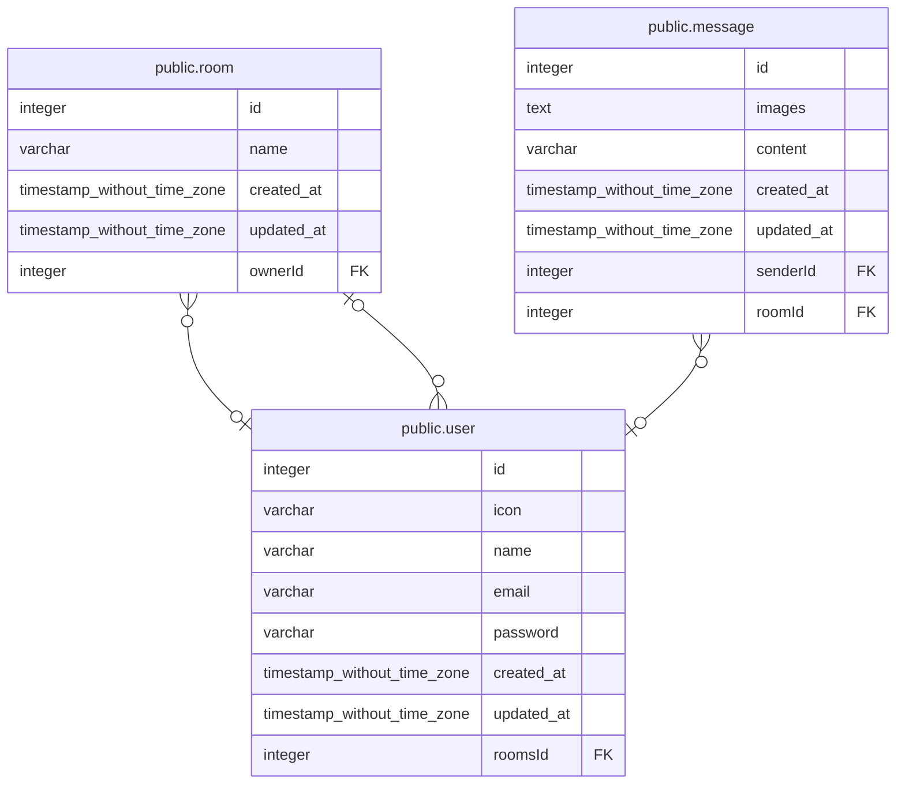

# public.user

## 概要

## カラム一覧

| 名前 | タイプ | デフォルト値 | Nullable | 子テーブル | 親テーブル | コメント |
| ---- | ------ | ------------ | -------- | ---------- | ---------- | -------- |
| id | integer | nextval('user_id_seq'::regclass) | false | [public.room](public.room.md) [public.message](public.message.md) |  |  |
| icon | varchar |  | false |  |  |  |
| name | varchar |  | false |  |  |  |
| email | varchar |  | false |  |  |  |
| password | varchar |  | false |  |  |  |
| created_at | timestamp without time zone | now() | false |  |  |  |
| updated_at | timestamp without time zone | now() | false |  |  |  |
| roomsId | integer |  | true |  | [public.room](public.room.md) |  |

## 制約一覧

| 名前 | タイプ | 定義 |
| ---- | ---- | ---------- |
| FK_61c6dfcd7aade4f490eee74613f | FOREIGN KEY | FOREIGN KEY ("roomsId") REFERENCES room(id) |
| PK_cace4a159ff9f2512dd42373760 | PRIMARY KEY | PRIMARY KEY (id) |
| UQ_e12875dfb3b1d92d7d7c5377e22 | UNIQUE | UNIQUE (email) |

## INDEX一覧

| 名前 | 定義 |
| ---- | ---------- |
| PK_cace4a159ff9f2512dd42373760 | CREATE UNIQUE INDEX "PK_cace4a159ff9f2512dd42373760" ON public."user" USING btree (id) |
| UQ_e12875dfb3b1d92d7d7c5377e22 | CREATE UNIQUE INDEX "UQ_e12875dfb3b1d92d7d7c5377e22" ON public."user" USING btree (email) |

## ER図

---

> Generated by [tbls](https://github.com/k1LoW/tbls)
